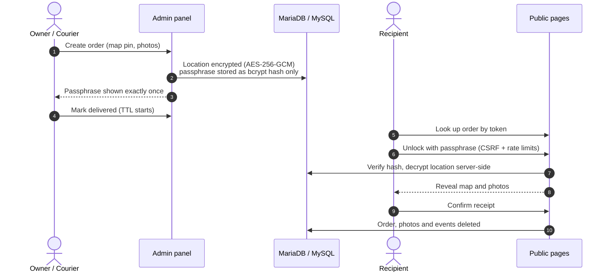
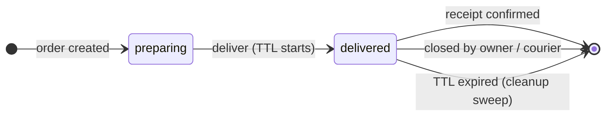
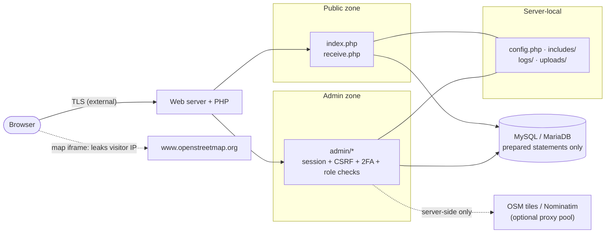

<div align="center">


# DeadDropMGMT

**A secure, bare-metal order management system for coordinating deliveries to dead-drop locations.**

Recipients look up an order by token, unlock an encrypted location with a passphrase and confirm receipt —
all without the underlying data ever leaving the server in readable form.

[](https://github.com/kilerdevs/DeadDropMGMT/actions/workflows/ci.yml)
[](https://github.com/kilerdevs/DeadDropMGMT/actions/workflows/sast.yml)
[](LICENSE)
[](https://github.com/kilerdevs/DeadDropMGMT/commits)
[](https://github.com/kilerdevs/DeadDropMGMT/issues)


-blue?style=flat)


[**Quick start**](#quick-start) ·
[**Features**](#features) ·
[**Threat model**](#threat-model) ·
[**Docker**](#docker) ·
[**Setup**](#setup) ·
[**Tests**](#tests) ·
[**Changelog**](CHANGELOG.md) ·
[**Security policy**](SECURITY.md)

</div>

---

## Disclaimer

> [!CAUTION]
> This project was created **for educational purposes** — to demonstrate secure application design: encryption at rest, CSRF protection, rate limiting, two-factor authentication, and audit logging in a real, working PHP application.
>
> The author provides this software **"as is," without warranty of any kind**, and assumes **no responsibility or liability for how it is used**, including but not limited to any illegal, unauthorized, or unintended use by any party. You are solely responsible for ensuring your use of this software complies with all applicable laws and regulations in your jurisdiction.
>
> **By downloading, installing, deploying, or otherwise using this software, you acknowledge that you have read this disclaimer and agree to be bound by it.** If you do not agree, do not use this software.

---

## Contents

| | |
|---|---|
| **Get started** | [Overview](#overview) · [Quick start](#quick-start) · [Features](#features) · [Tech stack](#tech-stack) |
| **Deploy** | [Docker](#docker) · [Setup (manual install)](#setup) · [Configuration reference](#configuration-reference) · [Requirements](#requirements) |
| **Maps** | [Self-hosted maps](#self-hosted-maps-opt-in-zero-third-party-tile-contact) |
| **Security** | [Threat model](#threat-model) · [Third-party code & external services](#third-party-code--external-services) |
| **Quality** | [Tests](#tests) |
| **Reference** | [Project structure](#project-structure) · [Troubleshooting](docs/TROUBLESHOOTING.md) · [Architecture decisions](docs/ADR.md) · [Contributing](#contributing) · [License](#license) |

---

## Overview

<table>
<tr>
<td width="50%" valign="top">

**For recipients**
- No account — a 16-character token is the capability
- Passphrase-gated location reveal, decrypted server-side
- Live expiry countdown, photo gallery, one-click Google / Apple Maps links
- One-tap delivery confirmation that wipes the order

</td>
<td width="50%" valign="top">

**For owners and couriers**
- Role-based admin panel (Owner / Courier)
- Map-pin order creation, photo upload, configurable TTL
- Mandatory 2FA for couriers, audit trail, tamper-evident log
- Panic mode, self-hosted offline maps, 8 UI languages

</td>
</tr>
</table>

### How an order travels



### Order lifecycle



Every transition is a conditional `UPDATE` / row-locked transaction, so concurrent or replayed requests are harmless no-ops.
Files are shredded only after the database transaction commits.

---

## Quick start

```bash
git clone https://github.com/kilerdevs/DeadDropMGMT.git
cd DeadDropMGMT
docker compose up -d --build
```

Open <http://localhost:2137/admin/> — on a fresh install the login page turns into a **create-owner form**:
pick a username and a password, done. The form disappears permanently once any account exists.

> [!TIP]
> Set `DDMGMT_SETUP_TOKEN` (and `DB_PASS`) in `.env` before exposing a fresh instance to a network — otherwise whoever
> reaches the page first can claim the owner account. See the [configuration reference](#configuration-reference).

Prefer nginx or Caddy? Bare-metal? See [Docker](#docker) and [Setup](#setup).

---

## Features

### Public (recipient) flow

- Token-based order lookup — no account needed
- Password-protected location reveal (AES-256-GCM, decrypted server-side, never sent to the client unencrypted)
- Live expiry countdown with redirect timer
- Photo gallery for reference images
- One-click links to Google Maps / Apple Maps
- Delivery confirmation endpoint
- Language switcher (8 languages) that works with and without JavaScript

### Admin dashboard

- Role-based access: **Owner** (full control) and **Courier** (own orders only)
- **Passwordless first login with enrollment secrets:** accounts can be created without a password — the owner receives a single-use, 24-hour enrollment code (shown exactly once, stored only hashed), and the login form asks for that code instead of a password for unclaimed usernames. Knowing just the username gets an attacker nothing; claiming burns the code (5-minute setup window, race-guarded, audited). Presetting a password at creation still works
- **Zero-config first run:** on a fresh install (no accounts yet) the login page itself becomes a create-owner form — pick a username, set a password, done; no SQL or seed constants needed. Optionally guarded by `DDMGMT_SETUP_TOKEN`
- Create orders with an interactive map picker (Leaflet / OpenStreetMap, or MapLibre with self-hosted zones)
- Auto-generated memorable pickup passphrases (6 words + 4-digit number + symbol, ~64.6 bits) — shown **once** at creation, stored only as a bcrypt hash, replaceable but never recoverable
- Extend / close / delete orders with CSRF-protected actions
- Photo upload with automatic GD compression
- Configurable TTL — orders auto-expire and are securely wiped
- **Two-factor authentication (TOTP)** — self-service enroll/disable per account, QR + manual entry, works with any RFC 6238 authenticator app — see [recommended open-source apps](TOTP-APPS.md); mandatory for couriers, optional but strongly encouraged for the owner (with a "why" explainer on the enrollment page and a persistent warning banner on every admin page while it's off)
- **Session hygiene:** sliding inactivity window (Settings, 30 min – 5 h, default 4 h) with a hard 12-hour ceiling; resetting an account's password or 2FA ends every session of that account
- Audit log — every write action recorded with actor, IP, and timestamp (kept 365 days)
- Analytics log: every lookup, unlock attempt, and confirmation recorded with IP + user-agent
- CSV export of the event log
- Log-chain integrity check with continuity verdict (owner only)
- Panic mode (owner only)

### Operations

- IP-based rate limiting with independent budgets per surface (pickup guessing, admin login, 2FA codes), per-account budgets on login and 2FA, and a per-session failure bucket for pickup. One global switch, attempt count (3–10, default 5) and window (5–60 min, default 15) in Settings
- Pseudo-cron cleanup on page visits: each request checks an hourly stamp, so at most one sweep per hour runs in-request (a cached settings lookup otherwise)
- Real cron endpoint (`cron/cleanup.php`) for server-side scheduling — the Docker image runs it every 15 minutes on its own
- Retention: order events for tokens that never matched an order are dropped after 30 days; the audit log after 365 days
- Secure file wipe: overwrites with null bytes before `unlink()` (best-effort — see [Residual risk](#5-residual-risk))
- Health probe at `/healthz.php` for containers and monitors

### Maps

- Default: server-proxied OpenStreetMap tiles, so admin IPs never reach OSM
- Opt-in: **self-hosted PMTiles zones** rendered with vendored MapLibre — zero third-party tile contact, see [Self-hosted maps](#self-hosted-maps-opt-in-zero-third-party-tile-contact)
- Optional fail-closed anonymity proxy pool for all outbound OSM traffic

---

## Tech stack

| Layer | Technology |
|---|---|
| Backend | PHP 8.2+ (strict types, procedural, no Composer at runtime; 8.0/8.1 are EOL and unsupported) |
| Database | MySQL / MariaDB |
| Encryption | OpenSSL — AES-256-GCM (authenticated), random nonce per record, HKDF purpose-subkeys |
| Auth | bcrypt cost=12, TOTP 2FA, CSRF tokens, session hardening |
| Frontend | Vanilla JS (ES5+), CSS Grid / Flexbox |
| Maps | Leaflet + OpenStreetMap (default) · MapLibre GL JS + PMTiles (self-hosted) |
| Webserver | Apache 2.4+ (`mod_rewrite`, `mod_headers`, `.htaccess` path protection) — or nginx / Caddy via the Docker stacks, which replicate every block natively |
| Tooling | PHPStan level 5, PHP-CS-Fixer, Playwright, `pcov` coverage (dev only) |

---

## Docker

Three interchangeable stacks — same app, different web server. Each boots Apache / nginx / Caddy plus MariaDB 11,
auto-loads `setup.sql` on first boot, renders `config.php` from the committed template and (if no `DDMGMT_AES_KEY_HEX`
is provided) generates a key and persists it on the `app-config` volume.

| Stack | Command |
|---|---|
| **Apache** (`mod_php`, default) | `docker compose up -d --build` |
| **nginx** + PHP-FPM | `docker compose -f docker-compose.nginx.yml up -d --build` |
| **Caddy** + PHP-FPM | `docker compose -f docker-compose.caddy.yml up -d --build` <br>(swap `:80` for your hostname in `docker/Caddyfile` for auto-TLS) |

The app is then on <http://localhost:2137> (`APP_PORT` in `.env` to change). Overrides live in `.env` (see `.env.example`) —
DB password, port, AES key.

### Volumes

| Volume | Holds | Lost on rebuild? |
|---|---|---|
| `db-data` | MariaDB data | no |
| `app-uploads` | order photos | no |
| `app-logs` | `app.log`, `error.log` | no |
| `app-cache` | OSM tile cache | no |
| `app-config` | the generated AES key | no |

> [!WARNING]
> **Back up the `app-config` volume** if you let the key auto-generate: losing it means losing all encrypted location data.
> The entrypoint re-reads the key on every start and refuses to generate a new one for an existing install.

> [!NOTE]
> `data/` and `tiles/` (self-hosted map zone files) are **not** volumes: they live in the container layer and are wiped by
> a rebuild or recreate. The zone list survives in the database, but the files must be downloaded again (**Refresh** in
> Settings → Maps).

The Docker image also runs `cron/cleanup.php` every 15 minutes in the background and warns at boot when the published
default DB password is still in use. TLS is never terminated by the app — put certbot, a load balancer or
Caddy-with-a-hostname in front. CI builds both images (Apache, and the PHP-FPM one shared by nginx/Caddy) and smoke-tests
all three stacks end-to-end on every push.

---

## Setup

Manual (non-Docker) installation. For containers, see [Docker](#docker).

### 1. Database

One file, one command — works for a fresh install *and* for upgrading an existing database from any earlier version. Every statement is idempotent, so it's also safe to just re-run whenever you pull updates:

```bash
mysql -u root -p < setup.sql
```

### 2. config.php and the AES-256 key

```bash
cp config.php.example config.php
php -r "echo bin2hex(random_bytes(32)) . PHP_EOL;"
```

Copy `config.php.example` **whole** — it is not just settings: it also carries helpers the app needs
(`overwrite_and_unlink()`, the logger bootstrap, UTC timezone) and the fixed timing-attack dummies
(`DUMMY_AUTH_HASH`, `DUMMY_TOTP_SECRET`) that the login path fatals without. A hand-written `config.php` will break.

Provide the 64-hex-character key in one of these places (first match wins):

1. environment variable `DDMGMT_AES_KEY_HEX` (recommended — keeps it out of the working tree)
2. the file `/config/aes_key_hex` (what the Docker image uses)
3. the literal `AES_KEY_HEX` value inside `config.php`

DB credentials work the same way via `DDMGMT_DB_HOST` / `DDMGMT_DB_PORT` / `DDMGMT_DB_NAME` / `DDMGMT_DB_USER` /
`DDMGMT_DB_PASS`. **Back the key up.** Losing it means losing all encrypted location data.

### 3. Web server

**Apache:**

```apache
<VirtualHost *:443>
    DocumentRoot /var/www/deaddrops
    <Directory /var/www/deaddrops>
        Options -Indexes
        AllowOverride All
        Require all granted
    </Directory>
</VirtualHost>
```

Enable `mod_rewrite` and `mod_headers`, and set `AllowOverride All`.

> [!IMPORTANT]
> **nginx / Caddy installs — read this.** The shipped `.htaccess` files are an Apache-only mechanism: nginx and Caddy
> ignore them completely. A manual (non-Docker) nginx/Caddy install MUST replicate the blocks or `includes/`, `logs/`,
> `cron/`, `tools/`, `config.php`, and PHP execution under `uploads/` are exposed. Use `docker/nginx.conf` and
> `docker/Caddyfile` as the reference — every `deny all` / `respond 403` there is load-bearing.

### 4. Permissions

```bash
mkdir -p logs uploads cache data tiles
chown -R www-data:www-data logs uploads cache data tiles
chmod 750 logs uploads
```

`logs/` and `uploads/` hold order data; `cache/` is the OSM tile cache; `data/` holds the `pmtiles` CLI and `tiles/` receives map-zone downloads
(both only needed for [self-hosted maps](#self-hosted-maps-opt-in-zero-third-party-tile-contact)).

### 5. Create the owner

Browse to `/admin/`. With no accounts yet, the login page is a create-owner form. Set `DDMGMT_SETUP_TOKEN` first if the
instance is reachable from a network before you get there.

### 6. Cron (optional but recommended)

On anything with real traffic, install real cron — pseudo-cron only guarantees *eventual* expiry sweeps, and real cron
takes the page-hit path out of the latency budget entirely. CLI only (`cron/` is denied from the web on every stack):

```cron
# expiry sweep, log checkpoint, proxy re-probe
0 * * * * php /var/www/deaddrops/cron/cleanup.php
# only with self-hosted maps: advances queued zone downloads
*/15 * * * * php /var/www/deaddrops/cron/maps_sync.php
```

### 7. Two-factor authentication (mandatory for couriers, self-service)

No server setup needed — log in, open **2FA** in the sidebar, scan the QR code with any RFC 6238 TOTP authenticator app (need one? see [TOTP-APPS.md](TOTP-APPS.md) for open-source picks per platform), and confirm with a code. Each account (owner or courier) enables/disables its own 2FA — 2FA is mandatory for couriers and strongly recommended (though optional) for the owner; the enrollment page explains why for each role, and a red banner nags every other admin page until it's on. The owner can force-reset a locked-out account's 2FA from **Users**.

### Database TLS and proxy trust (distributed deployments)

Same-host installs (app and MySQL on one machine) need nothing here — the DB port never leaves the box. When the database
lives on another host, encrypt the connection by pointing `DDMGMT_DB_SSL_CA` at the CA bundle that signed the server
certificate (optional client cert/key: `DDMGMT_DB_SSL_CERT`, `DDMGMT_DB_SSL_KEY`; certificate verification is on by
default and only explicitly disableable via `DDMGMT_DB_SSL_VERIFY_CERT=0` — don't, outside throwaway labs).

Behind a reverse proxy or CDN, set `DDMGMT_TRUST_PROXY=1` so rate limiting and the audit log see the real client address
from `CF-Connecting-IP` / `X-Forwarded-For` / `X-Real-IP`. Without that flag the headers are ignored — otherwise any
client could spoof its IP and sidestep the limiter. Only enable it when the proxy overwrites (not appends to) these
headers.

The flag alone is not enough: headers are honored only when the **direct connection peer** (`REMOTE_ADDR`) matches
`DDMGMT_TRUSTED_PROXIES` — a comma-separated list of IPs or CIDR ranges. Unset, it defaults to loopback and RFC1918 space
(`127.0.0.0/8`, `::1`, `10/8`, `172.16/12`, `192.168/16`), which fits same-host nginx/Apache and private docker networks.
If your proxy connects from public addresses, list them explicitly. A request whose peer is not on the list gets its
proxy headers ignored (and logs one warning) even with the flag set — so a stale flag on an app that is directly
reachable cannot be turned into free IP rotation by whoever finds it. The same peer gate covers `X-Forwarded-Proto`
(HTTPS detection for the session cookie `secure` flag and HSTS): a forged proto from an untrusted peer cannot plant a
`secure` cookie over plain HTTP.

<details>
<summary><b>Rotating the AES key</b> — when, why and the exact procedure</summary>

<br>

Rotate when the key may have been exposed (leaked backup, departed admin, incident), or on a schedule you would defend to
the people whose locations you hold — yearly is a reasonable default. The bundled tool makes it mechanical:

```bash
# rehearse first: verifies every row decrypts with the old key, writes nothing
php tools/rotate_aes_key.php --old=<OLD_64HEX> --new=<NEW_64HEX> --dry-run

# apply: re-encrypts orders.locations, pickup passwords and TOTP secrets,
# verifies each row read-back under the new key, single transaction —
# any undecryptable row aborts and rolls everything back
php tools/rotate_aes_key.php --old=<OLD_64HEX> --new=<NEW_64HEX>
```

Procedure:

1. **Back up the database.**
2. **Verify the log chain** (Settings → *Verify log integrity*) and **archive `logs/app.log`** — the chain is HMAC-keyed
   with the AES key, so entries written under the old key will not verify under the new one: the integrity check reports
   a mismatch at the first old entry until the log rotates out. Keep the archived file together with the old key if you
   may ever need to re-prove it.
3. Pick a maintenance window — no writes while rotating.
4. Run the dry-run, then the real rotation.
5. Switch `DDMGMT_AES_KEY_HEX` to the new key everywhere it lives (env vars, `config.php`, `/config/aes_key_hex`, backups
   of all of them) and restart the app.
6. Destroy every copy of the old key — otherwise nothing was gained.

Skipping rotation does not make data safer than rotating badly — but rotating *only in the docs while never doing it* is
how key compromise becomes total: one leaked 64-char string decrypts the entire history.

</details>

---

## Configuration reference

Every deployment knob is an environment variable; `config.php` reads the environment first and falls back to its literal
values.

| Variable | Default | Purpose |
|---|---|---|
| `DDMGMT_AES_KEY_HEX` | *(file / literal, see [Setup](#2-configphp-and-the-aes-256-key))* | 64-hex master key; every encryption purpose derives its own HKDF subkey from it |
| `DDMGMT_DB_HOST` / `_PORT` / `_NAME` | `localhost` / `3306` / `deaddrops` | Database location |
| `DDMGMT_DB_USER` / `DDMGMT_DB_PASS` | `root` / *(empty)* | Database credentials |
| `DDMGMT_DB_SSL_CA` / `_CERT` / `_KEY` | *(unset)* | TLS for a remote database |
| `DDMGMT_DB_SSL_VERIFY_CERT` | `1` | Set `0` only in throwaway labs |
| `DDMGMT_TRUST_PROXY` | `0` | Honor `X-Forwarded-*` / `CF-Connecting-IP` from a trusted peer |
| `DDMGMT_TRUSTED_PROXIES` | loopback + RFC1918 | Comma-separated IPs / CIDRs allowed to set proxy headers |
| `DDMGMT_SETUP_TOKEN` | *(unset)* | When set, creating the first owner requires this token; when unset the first visitor claims the instance (logged as a warning) |
| `DDMGMT_PMTILES_URL` / `DDMGMT_PMTILES_BIN` | *(unset)* | Use your own `pmtiles` CLI download / binary — opts out of the pinned SHA-256 (trust-on-first-use instead) |

**Docker `.env` overrides:** `APP_PORT` (default `2137`), `DB_PASS` (default `deaddrop-db`), `DB_ROOT_PASS`
(default `deaddrop-root`), plus `DDMGMT_AES_KEY_HEX`. Change the defaults before exposing the stack.

Runtime behavior (rate limits, session length, TTL, upload size, map provider, …) is configured in the admin **Settings**
page, not in files.

---

## Requirements

- **PHP 8.2+** with `pdo_mysql`, `openssl`, `mbstring` and `gd` (JPEG, PNG and WebP support). `curl` is needed for the
  optional proxy pool and auto-discovery
- **MySQL 5.7+ or MariaDB 10.3+** (CI-tested: MariaDB 11 and MySQL 8.0)
- **Apache 2.4+** with `mod_rewrite`, `mod_headers` — or nginx / Caddy (Docker stacks; manual installs must replicate every
  deny block, see [Setup §3](#3-web-server))
- **Self-hosted maps only:** process execution (`proc_open`) for the `pmtiles` CLI, Linux x86_64 or arm64, and free disk
  for the zones you draw

Stuck? Symptom → cause → fix lives in [docs/TROUBLESHOOTING.md](docs/TROUBLESHOOTING.md).

---

## Self-hosted maps (opt-in, zero third-party tile contact)

Settings → Maps → **Map provider**: `OpenStreetMap (online)` (default, unchanged behaviour) or `Self-hosted (offline zones)`.
The self-hosted path renders same-origin PMTiles zone files with the vendored MapLibre client — the browser never contacts
OSM, a font host, or a CDN (pinned by e2e specs that abort every non-local request and still see rendered maps, admin
picker and public reveal alike).

| Capability | How it works |
|---|---|
| **Zones** | Admin-drawn rectangles (name + west/south/east/north + z14 standard / z15 max detail). Each becomes one `tiles/zone_<id>_<token>.pmtiles` file carved from the daily Protomaps planet build — only the zone's bytes cross the wire, never the ~140 GB planet. The token is a 128-bit random part of the file name: the name itself is the access control, and legacy guessable names (`zone_<id>.pmtiles`) are denied |
| **Zone editor** | The bbox can be typed or drawn directly on an OSM canvas in the same section (same-origin tiles via `tile_proxy.php`, so still zero third-party contact): drag to draw, drag the body to move, corners to resize; overlapping drafts warn with the shared-tiles percentage and existing zones render in red. A place search pans through the proxied Nominatim path |
| **Route consent per download** | Proxy pool (anonymous, can be extremely slow — pool proxies are volunteer-run) or direct (fast, reveals the server IP to the tile host). Proxy mode is fail-closed: no working pool proxy means a failed job, never silent direct |
| **Sizing before downloading** | The worker dry-runs each zone for its exact byte count and refuses zones that don't fit the free disk (512 MiB headroom always kept). Deleting a zone frees its disk immediately; the worker measures, downloads with live speed/ETA, verifies, and publishes atomically |
| **Worker** | `cron/maps_sync.php` (system cron recommended, e.g. every 15 min; the Settings page kicks it detached after queueing when the platform allows). Page visits never download — extracts can't resume, so a killed request would waste the whole transfer; the hourly pseudo-cron steward only fails jobs whose worker died silently (`maps_steward_if_due()` in `index.php`) |
| **Freshness** | The planet rebuilds daily and each zone remembers the build it was cut from. When the worker next learns a newer build, ready zones cut from older ones show an *Update available* badge with a **Refresh** button that re-queues them — the worker re-downloads and republishes atomically, so the old file keeps serving until the new one lands. Freshness is computed from the cached build key only; no page view ever fetches the build list |
| **Public reveal** | With the self-hosted provider, a delivered order whose pin sits inside a ready zone renders the same MapLibre stack on the public reveal page (`reveal-map.js`, style inlined server-side — no new endpoint) instead of the OSM iframe. Only the covering zones' files are fetched, so zones elsewhere stay undisclosed; a pin outside every zone (or provider `osm`) keeps the OSM embed. The Google/Apple Maps links remain plain outbound links either way |
| **`pmtiles` CLI** | Pinned v1.31.2 (Linux x86_64 / arm64), fetched automatically on first use over TLS and verified against built-in SHA-256 pins (archive and binary) *before* it is ever executed. Only when you override the download (`DDMGMT_PMTILES_URL` / `DDMGMT_PMTILES_BIN`) or run another architecture does the app fall back to a trust-on-first-use hash recorded in `maps_cli_sha256`. Address search still uses the proxied Nominatim path — self-hosted geocoding (100 GB+ PostGIS) is deliberately out of scope |

---

## Threat model

### 1. Attacker capabilities

The model assumes adversaries ranging from opportunistic to well-resourced:

| # | Adversary | Capabilities |
|---|---|---|
| A1 | Random internet scanner | Unauthenticated HTTP requests against public endpoints; automated exploitation tooling |
| A2 | Curious recipient / courier | Legitimate access to their own order data; attempts to read *other* orders or admin functions |
| A3 | Network observer | Passive traffic sniffing between client and server (mitigated externally by TLS — see Residual Risk) |
| A4 | Malicious DB reader | Read (not write) access to the MySQL database via SQL injection elsewhere on a shared host, stolen dump, or careless backups |
| A5 | Log/backup tamperer | Filesystem write access to `logs/` and `uploads/` through a path traversal bug or compromised cron — wants to erase traces of an intrusion |
| A6 | Host-level attacker | Full code execution on the server |

### 2. Assets

| # | Asset | Sensitivity |
|---|---|---|
| S1 | Drop locations (encrypted at rest) | Core secret — physical safety of the recipient depends on it |
| S2 | Pickup passwords | Gate location reveal |
| S3 | Order tokens (16-char lookup codes) | Capability URLs — possession grants lookup access |
| S4 | TOTP secrets | 2FA enrollment for owner/courier accounts |
| S5 | Admin sessions & credentials | Full panel control |
| S6 | Audit trail & application log integrity | Evidence — must survive tampering attempts (A5) |
| S7 | Availability | Delivered orders auto-expire; loss is by design but premature loss is not |

### 3. Trust boundaries



- **Public ↔ PHP**: no accounts — but sessions exist: the unlock form carries a single-use CSRF token (verified before any limiter budget is spent), and the reveal lives server-side sealed. Only token entropy + rate limiting protect S3 itself
- **Admin ↔ PHP**: session cookie + CSRF token + TOTP; owner vs courier role split
- **PHP ↔ MySQL**: prepared statements; the DB is *never* trusted to hold secrets in readable form (S1–S4 encrypted/hashed before insert)
- **PHP ↔ filesystem**: `.htaccess` denies direct web access to `includes/`, `logs/`, `cache/`, `cron/`, `tools/`, `tests/`, `data/`, `config.php` and friends (nginx/Caddy replicate the same denies — see the [setup warning](#3-web-server))
- **PHP ↔ OSM**: server-side proxies so admin IPs never leave the server; fail-closed proxy pool optional

### 4. Mitigations (capability → asset mapping)

| Threat | Mitigation | Protects | Against |
|---|---|---|---|
| SQL injection | PDO prepared statements throughout — zero string interpolation in SQL | S1–S5 | A1–A2 |
| Password storage | bcrypt cost=12 via `password_hash()` / `password_verify()` | S5 | A4 |
| Account takeover | TOTP 2FA (RFC 6238) — self-service per account, secret GCM-encrypted at rest. Passwordless accounts are claimed only with a single-use enrollment secret, never by username alone. Per-account attempt budgets on login and 2FA; password / 2FA resets end all of the account's sessions; hard 12-hour session ceiling | S5 | A1, A2 |
| Location data at rest | AES-256-GCM (authenticated), random nonce per record; keys are HKDF purpose-subkeys of the master key — locations, TOTP secrets, reveal payloads and the log chain each use their own (ADR-016). Legacy CBC rows and raw-master rows are rejected at runtime — migrate with `tools/migrate_cbc_to_gcm.php` then `tools/separate_keys.php`. Master key lives only in `config.php`, env (`DDMGMT_AES_KEY_HEX`) or the `/config/aes_key_hex` file — never in the DB | S1, S4 | A4 |
| Pickup password guessing | Dual budget enforced together: IP-based limiter (**fail-closed**: if the limiter DB is down, pickup and login are denied, not waved through) **and** a per-session failure bucket — whoever trips either is blocked; ≥64-bit generated passphrases (6 words + 4-digit + symbol), hash-only at rest, equalized-cost responses for unknown tokens | S2 | A1 |
| Rate-limit bypass via spoofed `X-Forwarded-For` | Proxy headers are honored only when `DDMGMT_TRUST_PROXY=1` (opt-in for reverse-proxy/CDN installs) **and** the direct peer matches `DDMGMT_TRUSTED_PROXIES` (default: loopback + RFC1918); header values are validated as literal IPs and `REMOTE_ADDR` is the default source of truth | S2 | A1 |
| Token enumeration | 16-char alphanumeric random tokens (~95 bits); unknown-token answers burn the same bcrypt cost and return the same body as wrong passwords when a credential was submitted; receipt requires the delivered state atomically; expired-but-not-yet-swept orders are treated as gone | S3 | A1 |
| Session fixation / theft | `session_regenerate_id(true)` on login; `httponly`, `samesite=Strict`, `secure` when HTTPS | S5 | A1, A2 |
| CSRF | 32-byte random token in session (64 hex chars), `hash_equals()` on every POST — public unlock forms included; single-use rotation, with a same-origin live-token endpoint so long-lived admin pages never go stale | S5, S7 | A2 |
| XSS | `htmlspecialchars(..., ENT_QUOTES, 'UTF-8')` on all user-derived output; strict CSP with nonces | S5 | A1, A2 |
| Clickjacking / sniffing | `X-Frame-Options: DENY`, `nosniff`, HSTS (over HTTPS), `Referrer-Policy: no-referrer`, `Cache-Control: no-store` | S5 | A1 |
| Error leakage | `display_errors=0`, exceptions caught and logged, generic user-facing messages | S1–S5 | A1 |
| Direct file access | `.htaccess` blocks `includes/`, `config.php`, `logs/`, `cache/`, `cron/`, `tools/`, `tests/`, `docker/`, `data/` and more (Apache only — see the [setup warning](#3-web-server)); every CLI script also refuses to run under a web SAPI. Map-zone files are served only under unguessable, token-bearing names | all local assets | A1 |
| Log tampering | Structured JSONL log chained with HMAC-SHA256 (per-entry sequence numbers); one-click verification reports the first broken entry *and* a continuity verdict against hourly DB checkpoints (`extends` / `truncated` / `rotated`) — the chain catches modification, the checkpoints catch pure tail deletion. HMAC key derived from AES key with domain separation | S6 | A5 |
| Unaccountable writes | Every admin create/edit/delete/setting-change logged with actor, IP, timestamp | S6 | A2, A5 |
| Admin IP exposure to OSM | Tile/geocode requests proxied server-side; optional fail-closed anonymity proxy pool (manual or auto-discovered) | owner/courier privacy | A3 |

### 5. Residual risk

What remains after mitigations — stated plainly:

- **A6 wins by definition.** An attacker with code execution reads the AES key, the DB, and the log-HMAC key from the same host; the log chain detects tampering but cannot prevent it. The design goal is: everything short of full host compromise stays defensible.
- **TLS and WAF are external.** The app terminates neither; without HTTPS in front, A3 sees everything including pickup passwords. Deploy behind TLS (certbot, hosting certs, load balancer) and ideally a WAF/edge layer.
- **OSM embed iframe** sends the *recipient's* IP to OpenStreetMap when viewing a delivered order's location — browser-side, outside app control. Zero third-party contact needs the [self-hosted map provider](#self-hosted-maps-opt-in-zero-third-party-tile-contact).
- **Legacy rows are rejected at runtime — both kinds.** Pre-GCM AES-CBC rows and rows encrypted under the raw master key (pre-HKDF, ADR-016) are both refused. Run `php tools/migrate_cbc_to_gcm.php` (only if pre-GCM rows may exist) and then `php tools/separate_keys.php` after upgrading, dry-run first; until both complete, old orders and TOTP secrets are unreadable by the app — loudly, not silently.
- **Pickup passwords are hash-only.** Generated credentials appear exactly once (creation flash message) and can be replaced in the order editor, but never displayed again. `php tools/purge_pickup_password_recovery.php` clears the encrypted copies older versions stored.
- **Panic mode destroys everything, evidence included** — orders, photos, event log, audit log, tile cache and on-disk logs; only accounts and settings survive. Partial filesystem failures are reported honestly and the wipe is re-runnable (ADR-015).
- **File wipe is best-effort.** Overwriting with null bytes before `unlink()` raises the bar for casual recovery; copy-on-write filesystems, SSD wear-leveling and journaling may retain the original blocks. Full-disk encryption is the only real answer.
- **Rate limiting is IP-based *plus* a per-session failure bucket**, which fixes both classic blind spots: strangers behind one NAT/VPN exit no longer lock each other out (separate session buckets), and an attacker must rotate IP *and* cookie per attempt. Still tunable in Settings; still no defense against truly industrial distributed guessing — the ≥64-bit passphrase and auto-expiry carry that.
- **Availability is best-effort**: pseudo-cron cleanup runs on page hits unless a real cron calls `cron/cleanup.php` (the Docker image does so every 15 minutes); nothing protects against DDoS.

---

## Third-party code & external services

The PHP backend has zero runtime dependencies — no Composer, no framework. The browser, however, does load a few third-party pieces. Full disclosure (licences and notices in [THIRD-PARTY-NOTICES.md](THIRD-PARTY-NOTICES.md)):

### Vendored (bundled in this repo, served from your own domain — no CDN, works under the strict CSP)

| Asset | Version | License | Used for |
|---|---|---|---|
| [Leaflet](https://leafletjs.com/) | 1.9.4 | BSD-2-Clause | Interactive map picker (`admin/vendor/leaflet/`) |
| [QRCode.js](https://github.com/davidshimjs/qrcodejs) (davidshimjs, based on Kazuhiko Arase's original) | — | MIT | Renders the 2FA enrollment QR code client-side (`admin/vendor/qrcode/`) |
| [IBM Plex Mono](https://github.com/IBM/plex) | v20, latin + latin-ext subsets only | SIL OFL 1.1 | The site's monospace font (`fonts/ibm-plex-mono/`, ~56 KB for all 4 files) |
| [Noto Sans map-label glyphs](https://github.com/protomaps/basemaps-assets) | Regular, Medium, Italic | SIL OFL 1.1 | SDF glyph ranges for the self-hosted MapLibre style (`fonts/glyphs/`, built with MapLibre's font-maker from Noto Sans) |
| [MapLibre GL JS](https://maplibre.org/) | 5.13.0 | BSD-3-Clause | Vector renderer for the self-hosted map provider (`maplibre/`) |
| [PMTiles JS client](https://github.com/protomaps/pmtiles) | 4.5.0 | BSD-3-Clause | Single-file tile reader (HTTP Range requests, no tile server) |

The JavaScript and CSS libraries are unmodified upstream source, committed as static files — nothing is fetched over the network to load them. Google Fonts previously served IBM Plex Mono; it's now self-hosted, subset to just the Latin ranges this UI (Polish/English) actually uses to keep it light.

### Proxied server-side (admin panel only)

The admin map picker (`admin/new_order.php`, `admin/edit.php`) never talks to OpenStreetMap directly. Tile requests go through `admin/tile_proxy.php` (validated `z`/`x`/`y`, PNG-only, rate-limited per admin, disk-cached under `cache/osm_tiles/` for 7 days and capped at 256 MiB by the cleanup pass, so repeat views don't even leave the server) and address search goes through `admin/geocode_proxy.php` to Nominatim. Both require an authenticated admin session. The upshot: an owner/courier's real IP and search queries are never exposed to OpenStreetMap — only this server's IP is, and the CSP (`includes/auth.php`) reflects that (`img-src`/`connect-src` no longer allowlist any OSM host for the admin panel).

### Live external services (real network calls the browser still makes)

| Service | Called from | Purpose | Why it isn't bundled |
|---|---|---|---|
| OpenStreetMap embed (`www.openstreetmap.org`) | Public location-reveal page | Embedded `<iframe>` map showing the pickup pin | Rendered server-side per arbitrary coordinate on request — there's nothing static to bundle |
| Google Maps / Apple Maps | Public location-reveal page | Plain outbound `<a href>` links | Not a resource load at all — nothing is fetched or embedded, so there's nothing to bundle. Clicking just opens the respective site in a new tab |

The public Content-Security-Policy allows exactly one external origin: `frame-src https://www.openstreetmap.org` for that iframe. The Google/Apple links are not resource loads, and everything the *server* fetches (below) never appears in a browser CSP. **Worth knowing:** with the default OSM provider, the embedded map iframe sends the *customer's* IP to OSM when they view a delivered order's location — that's a request their own browser makes, and is in some tension with the "no tracking" claim shown on the public pages (that claim is about *this app* not tracking recipients, not about the third party it embeds a map from). If your threat model requires zero third-party contact even for that, switch the map provider to [self-hosted](#self-hosted-maps-opt-in-zero-third-party-tile-contact): the public reveal then renders from your own zone files and the OSM embed stays only as the fallback.

### Fetched by the server (never by the browser)

| Service | When | What it sees |
|---|---|---|
| Nominatim (`nominatim.openstreetmap.org`) | Admin address search and place labels | This server's IP (or a pool proxy's) and the query |
| OSM tile hosts | Admin map tiles, cache misses only | This server's IP (or a pool proxy's) |
| Protomaps (`build.protomaps.com`, `build-metadata.protomaps.dev`) | Self-hosted map zone downloads and freshness checks | This server's IP, or a pool proxy's — per the route you consent to per download |
| GitHub releases (`github.com/protomaps/go-pmtiles`) | First use of the `pmtiles` CLI | This server's IP |
| Public proxy lists (`raw.githubusercontent.com`), anonymity judges and public-IP lookup services | Only when the owner clicks **Auto-discover** | This server's IP — see below |

<details>
<summary><b>Proxy auto-discovery sources</b> — what each list contributes and how candidates are vetted</summary>

<br>

All fetched from GitHub raw by the server (never the browser) when the owner clicks **Auto-discover** in Settings → proxy pool. Candidates are probed against a real OSM tile; HTTP proxies from unrated sources must additionally pass a live anonymity check (below). Sources, and what each contributes (`includes/proxy.php` is the single place these are configured):

| Source | Repo | Provides | Anonymity metadata |
|---|---|---|---|
| Proxifly | `proxifly/free-proxy-list` | HTTP + SOCKS4/5 (structured JSON) | Yes — per-proxy rating; only anonymous/elite HTTP accepted |
| monosans | `monosans/proxy-list` | HTTP, SOCKS4, SOCKS5 (hourly pre-checked) | No — HTTP entries treated as unrated, SOCKS anonymous by protocol |
| TheSpeedX | `TheSpeedX/PROXY-LIST` | HTTP, SOCKS4, SOCKS5 (high volume) | No — HTTP entries treated as unrated |
| roosterkid | `roosterkid/openproxylist` | HTTPS (CONNECT-capable HTTP), SOCKS5 (curated) | No — HTTP entries treated as unrated |

**Anonymity judges.** HTTP proxies without a source-provided rating are verified live: the server fetches a header-echo page *through* the candidate proxy and rejects it if the echo contains the server's own IP in the origin or any forwarded header (`Via`, `X-Forwarded-For`, …). Judges used, in order: `httpbin.org/get`, `azenv.net/` (plain HTTP so the check also works through CONNECT-less proxies). The server's own public IP is looked up first, directly, from `api.ipify.org` with `httpbin.org/ip` as fallback; if it cannot be determined, all unrated HTTP candidates are dropped rather than trusted. SOCKS proxies are never header-injecting by protocol design and skip this check.

**What this means for your server's exposure:** clicking Auto-discover makes your server's IP visible to GitHub (list fetch, direct — not proxied), to the public-IP lookup services, to every candidate proxy probed, and to the judge services. OSM itself is only contacted through accepted proxies while routing is enabled.

**Stale entries are re-probed automatically.** A manually added proxy is only format-checked at insert, so a typo'd-but-well-formed URL would sit at `new` forever. Every cleanup pass (hourly pseudo-cron, or real cron) re-probes the 3 stalest entries — never checked, or not checked in 7 days — against a real OSM tile and updates their status, so the pool display reflects reality even for proxies live traffic never exercises.

</details>

---

## Tests

A zero-dependency PHP suite (no PHPUnit — each file is a standalone script), a real-browser Playwright suite, a coverage gate and a mutation probe. All of it runs in GitHub Actions on every push.

| Layer | What it proves | Run it |
|---|---|---|
| **PHP suites** — 30 | Crypto, auth, limits, state machine, maps, i18n, fail-closed branches, live-HTTP flows | `php tests/schema_loader.php && php tests/run_all.php` |
| **Browser E2E** — 7 specs | What raw HTTP cannot see: no-JS paths, CSP-clean DOM, offline maps, mid-reveal UI | `npm ci && npx playwright install chromium && npm run e2e` |
| **Coverage gate** | Line coverage floors over `includes/` under `pcov` | `composer install && php tests/coverage_runner.php` |
| **Mutation probe** — 16 mutants | A tested guard versus a dead one | `php tools/mutation_probe.php` |
| **Static analysis** | PHPStan level 5, PHP-CS-Fixer, CVE gates, SBOMs, SAST | CI |
| **CI matrix** | PHP 8.2 · 8.3 · 8.4 · 8.5, plus MySQL 8 and a timezone-skew job, and all three Docker stacks | `.github/workflows/ci.yml` |

The suite never touches your real database: `tests/bootstrap.php` forces `DDMGMT_DB_NAME=deaddrops_test` and points the app at TCP loopback unless you say otherwise.

<details>
<summary><b>The 30 PHP suites</b>, by area</summary>

<br>

| Area | Suites |
|---|---|
| Crypto & keys | `CryptoTest` — AES-256-GCM roundtrip, tamper rejection, CBC/raw-key rejection, HKDF key separation |
| Authentication | `AuthTest` (login / 2FA / session fixation / logout), `AuthorizationTest`, `AuthorizationHttpTest` (owner vs courier, IDOR and destructive-IDOR probes over live HTTP), `Verify2faTest`, `SetupPasswordTest`, `TotpTest` (RFC 4648 base32 + RFC 6238 vectors), `TotpReplayTest`, `CsrfTest` |
| Rate limiting | `RateLimitTest` (budgets, scopes, window expiry, kill-switch), `RateLimitConcurrencyTest`, `RateLimitTzTest` |
| Order lifecycle | `StateTransitionTest`, `StateRaceTest` (atomic transitions under contention), `CleanupTest` (expiry + photo shredding + limiter purging), `PanicTest`, `PublicFlowTest` (token lookup, unlock, PRG reveal, receipt, per-session bucket) |
| Public pages & settings | `I18nTest`, `PublicLangTest` (public language choice vs admin account language), `SettingsTest` |
| Uploads | `UploadHardeningTest`, `PhotoCapTest` |
| Logging | `LoggerTest` — hash chain, continuity checkpoints, unusable-key behaviour |
| Maps & proxy | `MapsTest`, `MapsFetchTest` (zone tokens, CLI pins, worker lock, orphan sweep), `ProxyTest` (anonymity gate, tile cache), `ProxyClientTest` (response size ceilings) |
| Structure & guards | `KernelTest` (service manifest, CLI-only guards, web-server denies), `DispatchTest` (the thin admin dispatcher contract), `FailClosedTest` (every guard, limiter, wipe and decrypt path, plus the DB TLS option matrix) |

</details>

### Browser E2E (Playwright)

What raw HTTP cannot see, a real Chromium covers. The harness boots `php -S`, seeds an isolated `deaddrops_e2e` database
(never the PHP suite's `deaddrops_test`, so both can run side by side) and needs MariaDB on `127.0.0.1:3306` and PHP on
`PATH` (`PHP_BINARY` overrides the binary).

| Spec | Covers |
|---|---|
| `public-flow` | Public unlock → reveal → receipt → deletion |
| `lang-switcher` | Language switcher with and without JavaScript |
| `admin-smoke` | Admin login → edit → logout; language switch and logout from a stale page |
| `maps-selfhosted` | Admin picker on offline zones — every non-local request aborted |
| `maps-reveal` | Public reveal on offline zones |
| `maps-zones` | Zone manager UI paths |
| `maps-editor` | Draw / move / resize the zone rectangle |

### Coverage

A separate CI job runs the suite under `pcov` and reports line coverage over `includes/` — the security-critical library code (crypto, auth, TOTP, rate limiting, logger, proxy client, i18n, settings). The job enforces floors:

| Scope | Floor |
|---|---|
| Every security-critical file | 85% (80% for `db.php`, whose residual lines are the connect-failure `die()` itself) |
| Overall across `includes/` | 85% |
| Per-file pins | `net.php` 100 · `logger.php` 92 · `cleanup.php` 85 · `proxy.php` 63 (live proxy discovery stays external by design) |

Per-file pins lock in hermetic gains that were hard-won — any regression from the measured baseline fails the build. The summary lands in the job summary; a browsable HTML report is uploaded as an artifact for 14 days. Composer is dev-only tooling here, the application itself never touches it.

### Mutation probe

Line coverage cannot tell a tested guard from a dead one, so `tools/mutation_probe.php` applies a curated set of 16 logic-weakening mutants and requires the suite to kill every one:

- **CSRF:** comparison removed, token rotation removed
- **Limiter:** fail-open status, hardcoded bucket window, skipped purge
- **Auth:** login-fallback scope guard removed, table-missing check always true, session refresh removed, session ini softened
- **Tokens & output:** hex-only token alphabet, unescaped translation parameters
- **Cleanup:** sweep guard removed for preparing orders
- **Log chain:** linkage ignored, sequence numbers dropped, checkpoint neutered, continuity check neutered

It runs as a report-only CI job while the score baseline proves stable; a survived mutant is filed as a test-suite bug.

---

## Project structure

```
DeadDropMGMT/
│
├── index.php                 Public order lookup & location reveal
├── receive.php               Delivery confirmation endpoint
├── healthz.php               Container/monitor health probe
├── public.js, gallery.js     Public-facing JS (lookup flow, photo gallery)
├── reveal-map.js             Self-hosted public reveal map (MapLibre + PMTiles)
├── style.css                 Public CSS
├── favicon.svg               Green dead-drop pin on dark tile
├── error/                    Localized error pages (403 / 404 / 500 / 503)
├── config.php                DB credentials, AES key, helpers   ← never commit (from config.php.example)
├── setup.sql                 Full DB schema — one file, fresh install or upgrade
├── .htaccess                 Apache path protection (includes/, logs/, cron/, tools/, tests/, data/ …)
├── fonts/                    Self-hosted IBM Plex Mono + map label glyphs
├── maplibre/                 Vendored MapLibre GL JS + PMTiles client
├── public/                   Static public assets
│
├── admin/                    Admin panel (owner + courier roles)
│   ├── index.php             Login wall
│   ├── login.php             Credential check → 2FA if enabled
│   ├── bootstrap.php         Zero-config first run: creates the owner account
│   ├── check_setup.php       Login-form helper: does this username still await enrollment?
│   ├── setup_password.php    Claiming a passwordless account with its enrollment secret
│   ├── verify_2fa.php        TOTP code prompt (login step 2)
│   ├── 2fa.php               Self-service 2FA enroll / disable (QR + manual)
│   ├── orders.php            Order list with courier filtering
│   ├── new_order.php         Order creation form (map picker)
│   ├── create.php            Order creation handler
│   ├── edit.php              Edit order — status, location, password, photos
│   ├── delete.php            Legacy order-deletion endpoint
│   ├── dispatch.php + routes.php + actions/
│   │                         Single envelope for the nine admin actions —
│   │                         eight POST (extend, order_close, mark_delivered,
│   │                         photo_delete, save_setting, set_lang, logout,
│   │                         user_action) and the GET csrf_token — handling
│   │                         headers, session, 2FA gate, method, auth, CSRF
│   │                         and ownership; one-line shims per route keep
│   │                         the old URLs working
│   ├── log_verify.php        Log chain integrity verification (owner only)
│   ├── download_log.php      Error log export
│   ├── maps_action.php      Map zone manager (add / retry / delete / refresh / status)
│   ├── proxy_action.php      OSM proxy pool management (add / delete / discover)
│   ├── tile_proxy.php        Server-side OSM tile fetch (optional proxy routing)
│   ├── geocode_proxy.php     Server-side Nominatim address search
│   ├── osm_status.php        Badge feed: which proxy served the last OSM request
│   ├── osm_monit.php         Proxy status badge (map pages)
│   ├── users.php             Courier management (owner only)
│   ├── audit_log.php         Write-action audit trail (owner only)
│   ├── analytics.php         Event log viewer + CSV download
│   ├── panic.php             Emergency mode (owner only)
│   ├── settings.php          Configurable site parameters (incl. Settings → Maps)
│   ├── sidebar.php           Shared sidebar partial
│   ├── totp_banner.php       Shared disabled-2FA warning partial
│   ├── admin.js, style.css   Panel JS + CSS
│   ├── maplibre-picker.js, pin-label.js
│   │                         Self-hosted map picker and pin label
│   └── vendor/               Leaflet + QRCode.js — vendored locally, no CDN
│
├── includes/                 Blocked from web via .htaccess
│   ├── kernel.php            Single service manifest (all pages boot here)
│   ├── db.php                PDO singleton
│   ├── auth.php              Session, CSRF, rate limiting, security headers
│   ├── crypto.php            AES-256-GCM encrypt/decrypt, bcrypt, 64-bit passphrase generator
│   ├── order_state.php       Atomic state machine: deliver / receive / delete / expiry
│   ├── totp.php              TOTP (RFC 6238) — base32, otpauth:// URI
│   ├── audit.php             Write-action audit logger
│   ├── settings.php          Settings cache (one DB query per page load)
│   ├── i18n.php              Translation engine (8 languages, CLDR plurals,
│   │                         account preference + public ?lang= switcher)
│   ├── proxy.php             OSM outbound proxy pool + free-proxy discovery + tile cache
│   ├── maps.php              Self-hosted maps: zones, pmtiles CLI, worker, map style
│   ├── analytics.php         Event logger
│   ├── logger.php            Structured JSONL log + tamper-evident hash chain
│   ├── cleanup.php           Expired order deletion, retention (pseudo-cron + real cron)
│   ├── net.php               Client IP, proxy-header trust, HTTPS detection
│   ├── wipe.php              Panic wipe + secure file deletion driver
│   └── lang/                 Translations: pl, en, de, ru, fr, es, uk, it
│
├── cron/
│   ├── cleanup.php           Expiry sweep, checkpoints, proxy re-probe (CLI only)
│   └── maps_sync.php         Map zone download worker (CLI only)
│
├── logs/                     App + error log (blocked from web)
├── uploads/                  Order photos: served by URL, no listing,
│                             no PHP execution, no disk caching
├── cache/                    OSM tile disk cache (blocked from web)
├── data/                     Map worker files: the pmtiles CLI and scratch data (blocked from web)
├── tiles/                    Self-hosted map zones + style.php (zone files served
│                             only under token-bearing names)
├── tests/                    Zero-dependency suite (see Tests above)
├── e2e/                      Playwright specs, seed script, offline map fixture
├── tools/                    CLI maintenance: key rotation/separation,
│                             CBC→GCM migration, recovery purge, mutation probe
├── docker/                   Apache/nginx/Caddy front configs, entrypoint,
│                             php.ini overrides, e2e journey
├── docs/                     ADRs + troubleshooting guide
├── .github/                  CI + SAST workflows, Dependabot
│
├── Dockerfile, Dockerfile.fpm
├── docker-compose.yml, docker-compose.nginx.yml, docker-compose.caddy.yml
├── composer.json, package.json, playwright.config.js, phpstan.neon
│                             Dev tooling only — the app has no runtime dependencies
└── CHANGELOG.md, CONTRIBUTING.md, SECURITY.md, THIRD-PARTY-NOTICES.md,
    TOTP-APPS.md, LICENSE
```

---

## Contributing

Bug fixes, security hardening, and documentation improvements are welcome. See [CONTRIBUTING.md](CONTRIBUTING.md) for coding conventions, how to submit changes, and — importantly — how to report a security vulnerability privately rather than through a public issue. The vulnerability policy lives in [SECURITY.md](SECURITY.md); design rationale in [docs/ADR.md](docs/ADR.md); release notes in [CHANGELOG.md](CHANGELOG.md).

---

## License

MIT — see [LICENSE](LICENSE). The vendored third-party assets (Leaflet, QRCode.js, IBM Plex Mono, Noto Sans glyphs, MapLibre GL JS, PMTiles) keep their own licenses; see [Third-party code & external services](#third-party-code--external-services) and [THIRD-PARTY-NOTICES.md](THIRD-PARTY-NOTICES.md) for those.

This is separate from, and doesn't limit, the [Disclaimer](#disclaimer) above — the MIT license governs your rights to use, modify, and distribute the code, while the disclaimer addresses liability for how the software is used.

<div align="center">

<sub>Built for education · PHP · MariaDB · zero runtime dependencies</sub>

</div>
